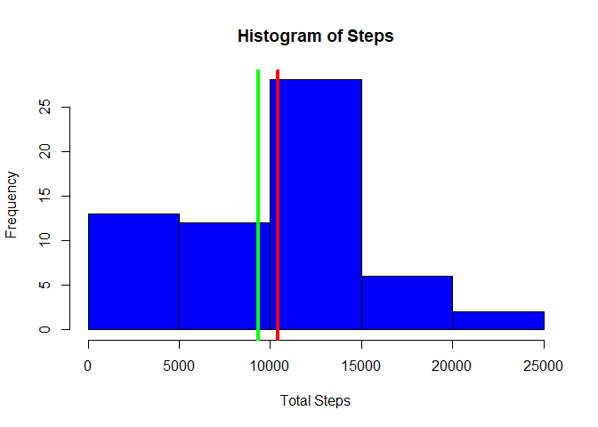
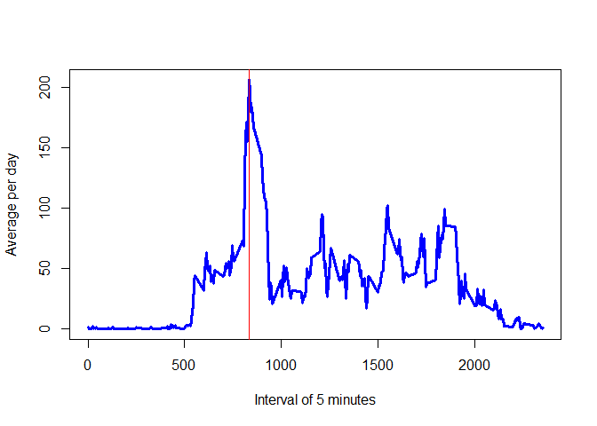
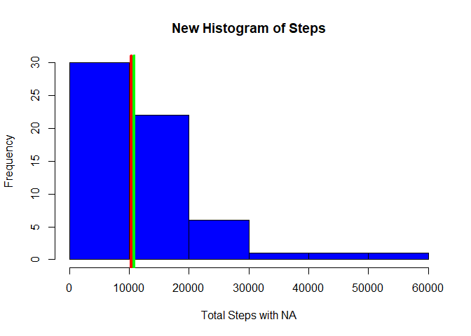
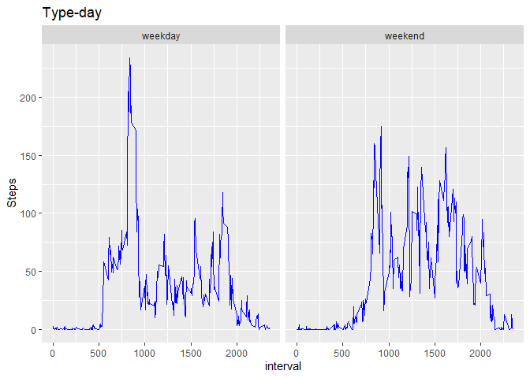

## Loading and preprocessing the data

The steps to load and transform the data are shown:


```r
options(scipen = 999)
library(ggplot2)
data1 <- unzip(list.files(pattern = ".zip"))
data1 <- read.csv(data1)
```

## What is mean total number of steps taken per day?

total steps per day


```r
T_step <- sapply(split(data1,data1$date),function(x){sum(x$steps,na.rm = T)})
T_step
```

```
## 2012-10-01 2012-10-02 2012-10-03 2012-10-04 2012-10-05 2012-10-06 2012-10-07 
##          0        126      11352      12116      13294      15420      11015 
## 2012-10-08 2012-10-09 2012-10-10 2012-10-11 2012-10-12 2012-10-13 2012-10-14 
##          0      12811       9900      10304      17382      12426      15098 
## 2012-10-15 2012-10-16 2012-10-17 2012-10-18 2012-10-19 2012-10-20 2012-10-21 
##      10139      15084      13452      10056      11829      10395       8821 
## 2012-10-22 2012-10-23 2012-10-24 2012-10-25 2012-10-26 2012-10-27 2012-10-28 
##      13460       8918       8355       2492       6778      10119      11458 
## 2012-10-29 2012-10-30 2012-10-31 2012-11-01 2012-11-02 2012-11-03 2012-11-04 
##       5018       9819      15414          0      10600      10571          0 
## 2012-11-05 2012-11-06 2012-11-07 2012-11-08 2012-11-09 2012-11-10 2012-11-11 
##      10439       8334      12883       3219          0          0      12608 
## 2012-11-12 2012-11-13 2012-11-14 2012-11-15 2012-11-16 2012-11-17 2012-11-18 
##      10765       7336          0         41       5441      14339      15110 
## 2012-11-19 2012-11-20 2012-11-21 2012-11-22 2012-11-23 2012-11-24 2012-11-25 
##       8841       4472      12787      20427      21194      14478      11834 
## 2012-11-26 2012-11-27 2012-11-28 2012-11-29 2012-11-30 
##      11162      13646      10183       7047          0
```
Histogram of the total number of steps taken each day


```r
hist(T_step,xlab = "Total Steps",main = "Histogram of Steps",col="blue")
abline(v=median(T_step),col="red",lwd=4)
abline(v=mean(T_step),col="green",lwd=4)
```

<!-- -->

The median of the total steps per day in red is 10395, and the mean of the total steps per day in green is 9354.23.

## What is the average daily activity pattern?

Time series of average number of steps per day for each five-minute interval


```r
library(dplyr)
```

```
## 
## Attaching package: 'dplyr'
```

```
## The following objects are masked from 'package:stats':
## 
##     filter, lag
```

```
## The following objects are masked from 'package:base':
## 
##     intersect, setdiff, setequal, union
```

```r
data2 <- group_by(data1,interval) %>% summarise(average= mean(steps,na.rm = T))
```

```
## `summarise()` ungrouping output (override with `.groups` argument)
```

```r
with(data2,plot(interval,average,type = "l",col="blue",lwd="3",xlab = "Interval of 5 minutes",ylab = "Average per day"))
abline(v=max(data2[data2$average==max(data2$average),1]),col="red",lwd=1)
```

<!-- -->

The five-minute interval with the highest average number of steps each day is 835

## Imputing missing values

1.Calculation of NA values


```r
colSums(is.na(data1))
```

```
##    steps     date interval 
##     2304        0        0
```
The variable steps contains 2304 NA values

2.We create a new data set by filling in the NA data with the mean of that five-minute interval.


```r
data3 <- merge(data1,data2)
data3$steps <- ifelse(is.na(data3$steps),data3$average,data3$steps)
data3$average<- NULL
colSums(is.na(data3))
```

```
## interval    steps     date 
##        0        0        0
```

3.We generate a histogram with the new data set of the total number of raisins given each day, and we calculate their mean and median.


```r
T_step2 <- sapply(split(data3,data1$date),function(x){sum(x$steps,na.rm = F)})
hist(T_step2,xlab = "Total Steps with NA",main = "New Histogram of Steps",col="blue")
abline(v=median(T_step2),col="red",lwd=4)
abline(v=mean(T_step2),col="green",lwd=4)
```

<!-- -->

The median of the total steps per day in red is 10351.62, and the mean of the total steps per day in green is 10766.19.

As seen in the following data, the means and medians of the data set with missing values differ with the completed values


```r
data.frame(data1=c(median(T_step),mean(T_step)),data3=c(median(T_step2),mean(T_step2)),diference=c(median(T_step2)-median(T_step),mean(T_step2)-mean(T_step)),row.names = c("median","mean"))
```

```
##           data1    data3  diference
## median 10395.00 10351.62  -43.37736
## mean    9354.23 10766.19 1411.95917
```
The impact generated by completing the missing data with the mean of each interval is that the median decreased by -43.3773585 and the mean increased by 1411.959171.

## Are there differences in activity patterns between weekdays and weekends?

We use the data set with missing values, we add a variable with the levels "weekday" and "weekend".


```r
data4 <- mutate(data1,typeday=as.Date(date))
data4$typeday <- as.factor(ifelse(weekdays(data4$typeday) %in% c("sábado","domingo"),"weekend","weekday"))
head(data4)
```

```
##   steps       date interval typeday
## 1    NA 2012-10-01        0 weekday
## 2    NA 2012-10-01        5 weekday
## 3    NA 2012-10-01       10 weekday
## 4    NA 2012-10-01       15 weekday
## 5    NA 2012-10-01       20 weekday
## 6    NA 2012-10-01       25 weekday
```
We generate a panel chart that contains time series charts by activity on weekends and weekdays.


```r
data4 <- group_by(data4,interval,typeday) %>% summarise(average= mean(steps,na.rm = T))
```

```
## `summarise()` regrouping output by 'interval' (override with `.groups` argument)
```

```r
ggplot(data4,aes(interval,average)) + geom_line(colour="blue") + facet_grid(.~typeday) + ylab("Steps") + labs(title = "Type-day")
```

<!-- -->
